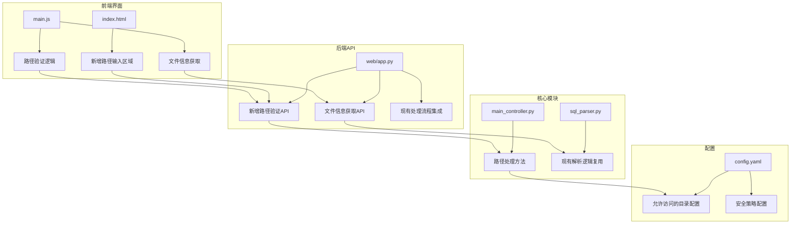
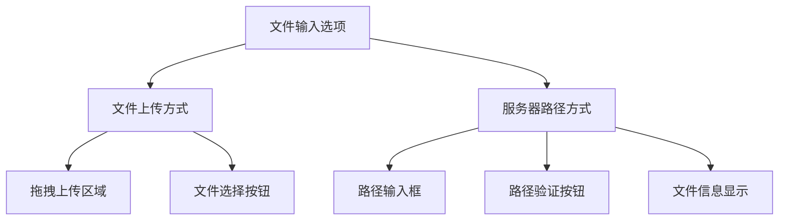
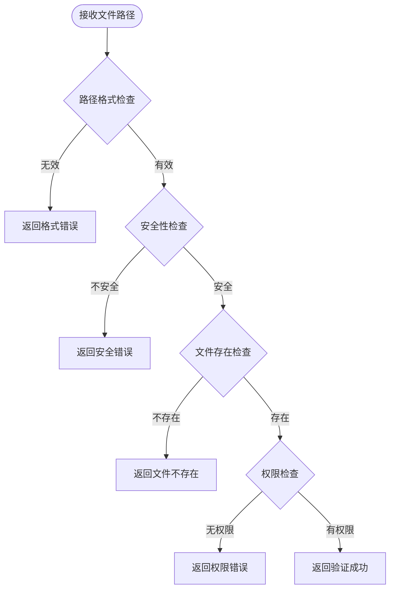
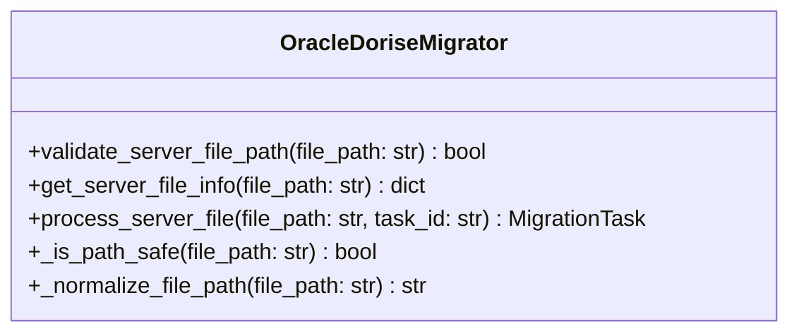
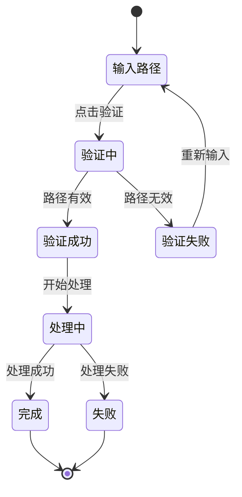

# 新增服务器SQL文件路径功能设计文档

## 概述

本文档设计新增指定服务器上现有SQL文件路径的功能。该功能允许用户直接使用已经上传到服务器的SQL文件，而无需重新上传，提高系统效率并减少重复文件传输。

## 需求分析

### 功能需求
- 用户可以通过Web界面输入服务器上SQL文件的绝对路径或相对路径
- 系统验证指定路径的文件是否存在且可访问
- 支持文件路径的格式验证（.sql后缀）
- 与现有的文件上传功能并行存在，用户可选择使用哪种方式
- 路径指定后的处理流程与上传文件相同（解析、推断、创建表、导入）

### 非功能需求
- 安全性：限制可访问的目录范围，防止路径遍历攻击
- 性能：避免重复文件读取和验证
- 用户体验：提供清晰的错误提示和文件信息预览

## 技术架构

### 组件修改范围



## 详细设计

### 1. 前端界面设计

#### 1.1 UI组件新增
在现有的文件上传区域旁边添加"服务器文件路径"输入区域：



#### 1.2 交互流程
1. 用户选择"服务器路径"方式
2. 输入文件路径
3. 点击"验证路径"按钮
4. 系统验证路径有效性并显示文件信息
5. 用户确认后开始处理流程

### 2. 后端API设计

#### 2.1 新增API端点

| 端点 | 方法 | 功能 | 参数 |
|------|------|------|------|
| `/validate_path` | POST | 验证服务器文件路径 | `{"file_path": "string"}` |
| `/file_info` | POST | 获取文件基本信息 | `{"file_path": "string"}` |
| `/process_server_file` | POST | 处理服务器文件 | `{"file_path": "string"}` |

#### 2.2 路径验证逻辑



### 3. 安全设计

#### 3.1 路径安全策略
- **白名单机制**：配置允许访问的目录列表
- **路径规范化**：使用`os.path.normpath()`防止路径遍历攻击
- **扩展名验证**：只允许`.sql`文件
- **权限检查**：验证文件读取权限

#### 3.2 配置文件扩展
在`config.yaml`中新增安全配置：

```yaml
file_access:
  allowed_directories:
    - "/var/data/sql"
    - "/opt/migration/uploads"
    - "./uploads"
  max_file_size_mb: 1024
  allowed_extensions: [".sql"]
```

### 4. 核心功能集成

#### 4.1 主控制器扩展
在`OracleDoriseMigrator`类中新增方法：



#### 4.2 处理流程统一
服务器文件路径和上传文件使用相同的处理流程：
1. 文件解析 → `sql_parser.extract_sample_data()`
2. 结构推断 → `schema_engine.infer_table_schema()`
3. 表创建 → `db_connection.create_table()`
4. 数据导入 → `parallel_importer.import_data()`

### 5. 错误处理机制

#### 5.1 错误分类与处理

| 错误类型 | 错误码 | 处理方式 |
|----------|--------|----------|
| 路径格式错误 | PATH_001 | 前端实时验证提示 |
| 路径安全错误 | PATH_002 | 拒绝请求，记录日志 |
| 文件不存在 | PATH_003 | 友好错误提示 |
| 权限不足 | PATH_004 | 权限错误提示 |
| 文件过大 | PATH_005 | 文件大小限制提示 |

#### 5.2 日志记录
新增服务器文件访问日志：
- 文件路径访问记录
- 安全检查结果
- 处理状态跟踪

### 6. 用户体验优化

#### 6.1 路径输入辅助功能
- 路径自动补全建议
- 常用路径快捷选择
- 路径格式实时验证
- 文件信息即时预览

#### 6.2 状态反馈


## 实现方案

### 阶段一：后端API开发
1. 扩展`web/app.py`，新增路径验证和处理API
2. 修改`main_controller.py`，添加服务器文件处理方法
3. 更新配置文件格式

### 阶段二：前端界面开发
1. 修改`templates/index.html`，添加路径输入UI组件
2. 扩展`static/js/main.js`，实现前端验证和交互逻辑
3. 更新CSS样式

### 阶段三：集成测试
1. 功能测试：验证各种路径场景
2. 安全测试：验证路径遍历防护
3. 性能测试：测试大文件处理性能

### 阶段四：文档更新
1. 更新用户使用指南
2. 更新API文档
3. 添加故障排除说明

## 测试策略

### 单元测试
- 路径验证逻辑测试
- 安全检查功能测试
- 文件信息获取测试

### 集成测试
- 端到端处理流程测试
- API接口测试
- 前后端交互测试

### 安全测试
- 路径遍历攻击测试
- 权限提升测试
- 非法文件访问测试

### 性能测试
- 大文件路径验证性能
- 并发路径访问测试
- 内存使用情况监控

## 配置示例

### 新增配置项
```yaml
# 文件访问配置
file_access:
  # 允许访问的目录列表
  allowed_directories:
    - "/data/oracle_dumps"
    - "/var/migration/sql"
    - "./uploads"
    - "./tests/sample_data"
  
  # 安全设置
  max_file_size_mb: 2048
  allowed_extensions: [".sql"]
  enable_path_traversal_protection: true
  
  # 性能设置
  file_info_cache_ttl: 300  # 文件信息缓存时间（秒）
  max_concurrent_validations: 10  # 最大并发验证数

# Web界面配置扩展
web_interface:
  # 路径输入功能
  enable_server_path_input: true
  path_suggestions:
    - "/data/oracle_dumps/"
    - "/var/migration/sql/"
  max_path_length: 255
```

## 兼容性考虑

### 向后兼容
- 现有文件上传功能保持不变
- 现有API接口不受影响
- 配置文件向后兼容

### 功能增强
- 两种文件输入方式可以并存
- 处理流程完全一致
- 监控和日志功能统一

## 监控与维护

### 运行监控
- 服务器文件访问频率统计
- 路径验证成功率监控
- 处理性能指标跟踪

### 维护便利性
- 配置热更新支持
- 允许目录动态调整
- 日志级别可配置

## 风险评估

### 技术风险
- **中等风险**：路径遍历安全漏洞
- **缓解措施**：严格的路径验证和白名单机制

### 运维风险
- **低风险**：服务器文件权限配置错误
- **缓解措施**：详细的配置文档和权限检查

### 用户体验风险
- **低风险**：路径输入复杂性
- **缓解措施**：路径提示和自动补全功能