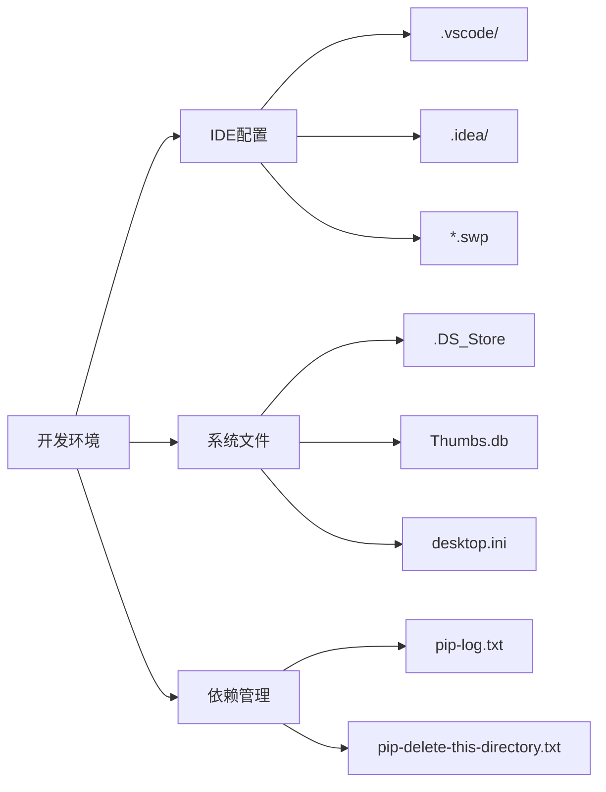

# .gitignore 文件设计文档

## 概述

为Oracle到Doris数据迁移工具项目创建一个全面的.gitignore文件，确保不必要的文件（如Python运行库、缓存文件、临时文件等）不被纳入版本控制系统。

## 项目类型分析

基于项目结构分析，这是一个Python后端应用，具有以下特征：
- Flask Web框架应用
- 包含数据库连接和数据迁移功能
- 使用外部API（DeepSeek R1）
- 支持WebSocket实时通信
- 包含测试模块

## .gitignore 文件结构设计

### 1. Python 相关忽略项

```mermaid
graph TD
    A[Python 忽略项] --> B[字节码文件]
    A --> C[发行版/打包]
    A --> D[PyInstaller]
    A --> E[单元测试/覆盖率]
    A --> F[虚拟环境]
    
    B --> B1[__pycache__/]
    B --> B2[*.py[cod]]
    B --> B3[*$py.class]
    
    C --> C1[build/]
    C --> C2[dist/]
    C --> C3[*.egg-info/]
    
    D --> D1[*.manifest]
    D --> D2[*.spec]
    
    E --> E1[.coverage]
    E --> E2[htmlcov/]
    
    F --> F1[venv/]
    F --> F2[env/]
    F --> F3[.venv/]
```

### 2. 项目特定忽略项

| 类别 | 文件模式 | 说明 |
|------|----------|------|
| 配置文件 | `config.yaml` | 包含敏感信息的实际配置 |
| 日志文件 | `*.log` | 运行时生成的日志 |
| 临时文件 | `temp/` | 数据迁移临时文件目录 |
| 备份文件 | `*.bak`, `*.backup` | 数据备份文件 |
| SQL文件 | `*.sql` | 可能包含敏感数据的SQL文件 |

### 3. 开发环境忽略项



### 4. 安全相关忽略项

重点关注包含敏感信息的文件：
- API密钥配置文件
- 数据库连接配置
- 环境变量文件
- 证书和密钥文件

### 5. 性能优化忽略项

避免提交大文件和缓存：
- 数据文件（*.csv, *.json 数据样本）
- 缓存文件
- 编译产物
- 依赖包文件

## .gitignore 文件内容规划

### 基础Python忽略规则
```
# 字节码 / 优化 / DLL 文件
__pycache__/
*.py[cod]
*$py.class

# C 扩展
*.so

# 发行版 / 打包
.Python
build/
develop-eggs/
dist/
downloads/
eggs/
.eggs/
lib/
lib64/
parts/
sdist/
var/
wheels/
*.egg-info/
.installed.cfg
*.egg
MANIFEST
```

### 虚拟环境
```
# 虚拟环境
venv/
env/
ENV/
.venv/
.ENV/
```

### 项目特定规则
```
# 配置文件 (保留示例文件)
config.yaml
!config.yaml.example

# 日志文件
*.log
logs/
migration.log*

# 临时文件和缓存
temp/
tmp/
cache/
.cache/

# 数据文件
*.sql
*.csv
*.json
!tests/sample_data/*.sql

# 备份文件
*.bak
*.backup
*.old
```

### IDE和编辑器配置
```
# IDE 配置
.vscode/
.idea/
*.swp
*.swo
*~
.project
.pydevproject

# 系统文件
.DS_Store
.DS_Store?
._*
.Spotlight-V100
.Trashes
ehthumbs.db
Thumbs.db
desktop.ini
```

### 测试和覆盖率
```
# 单元测试 / 覆盖率报告
htmlcov/
.tox/
.coverage
.coverage.*
.cache
nosetests.xml
coverage.xml
*.cover
.hypothesis/
.pytest_cache/
```

## 实施建议

### 1. 优先级设置
- **高优先级**: Python字节码、虚拟环境、敏感配置
- **中优先级**: 日志文件、临时文件、IDE配置
- **低优先级**: 系统文件、备份文件

### 2. 维护策略
- 定期审查忽略规则的有效性
- 新增功能时及时更新忽略规则
- 团队协作时统一忽略规则

### 3. 注意事项
- 保留示例配置文件（如 config.yaml.example）
- 保留测试数据文件（在tests/sample_data/目录下）
- 确保不忽略必要的静态资源文件

## 验证方法

### 检查命令
```bash
# 查看被忽略的文件
git status --ignored

# 检查特定文件是否被忽略
git check-ignore -v 文件名

# 强制添加被忽略的文件（如果需要）
git add -f 文件名
```

### 测试场景
1. 创建虚拟环境后验证是否被正确忽略
2. 运行应用生成日志文件后检查忽略状态
3. 复制配置文件后确认敏感信息不被提交