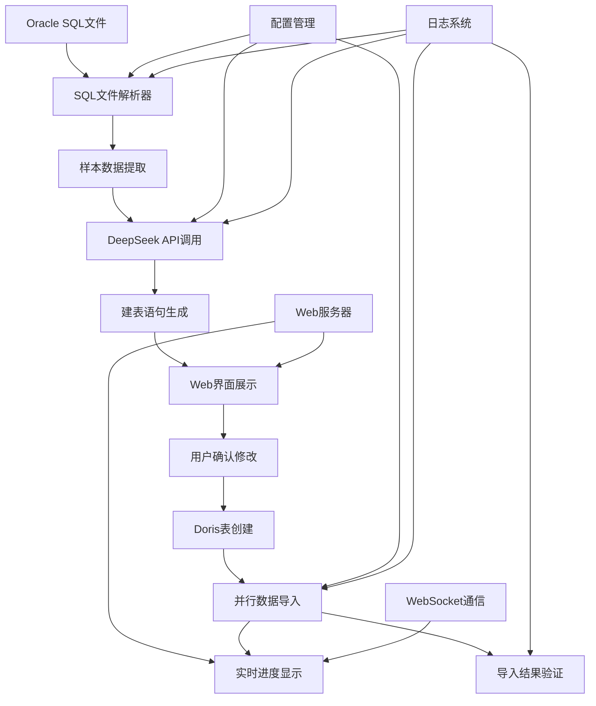
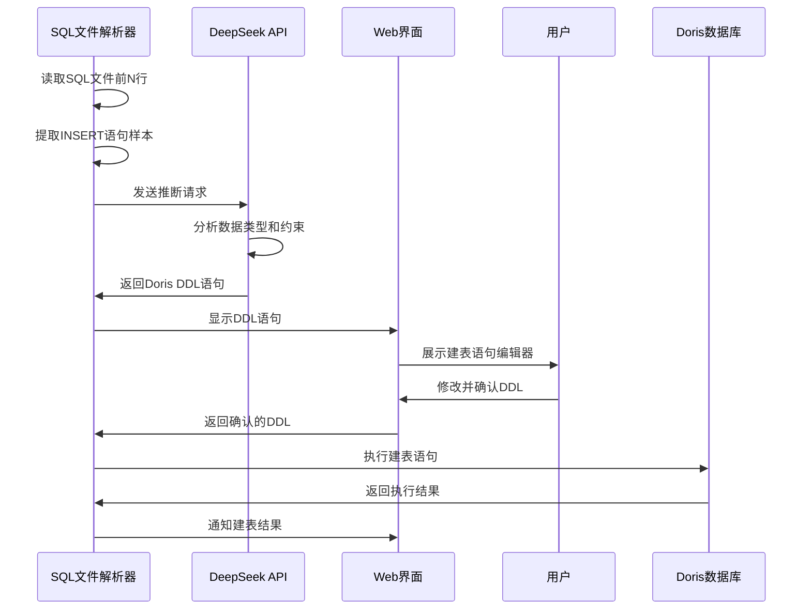
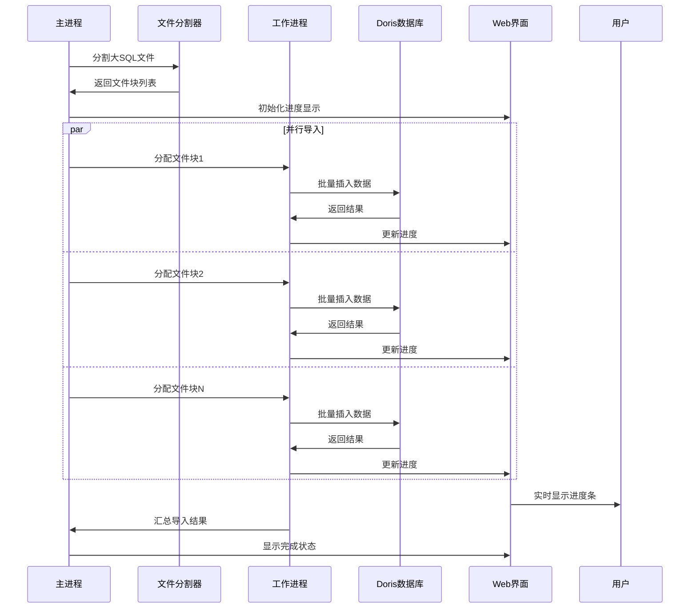
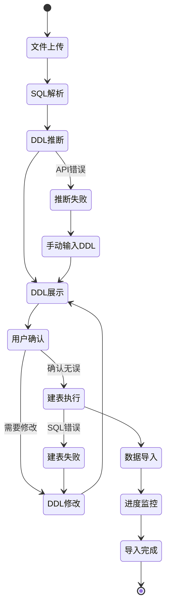

# Oracle到Doris数据迁移系统设计

## 概述

本系统用于将从Oracle数据库导出的SQL文件（包含大量insert语句）高效迁移到Apache Doris数据库中。系统包含表结构推断、建表语句生成、以及大数据量并行导入等核心功能。

### 核心目标
- 自动从Oracle SQL文件推断表结构
- 生成适配Doris的建表语句
- 高效批量导入大数据量（单表几十GB）
- 支持并行处理提升吞吐性能

## 技术栈

- **编程语言**: Python 3.8+
- **目标数据库**: Apache Doris
- **AI服务**: DeepSeek R1 API
- **Web框架**: Flask + Socket.IO
- **前端技术**: HTML5 + JavaScript + WebSocket
- **依赖库**: 
  - `pymysql` - Doris连接
  - `requests` - API调用
  - `concurrent.futures` - 并行处理
  - `pandas` - 数据处理
  - `flask` - Web服务
  - `flask-socketio` - 实时通信
  - `logging` - 日志记录

## 系统架构



## 核心模块设计

### 1. SQL文件解析模块 (SQLFileParser)

**职责**: 解析Oracle导出的SQL文件，提取样本数据

**核心方法**:
```python
class SQLFileParser:
    def extract_sample_data(file_path: str, n_lines: int) -> Dict
    def identify_table_name(sql_content: str) -> str
    def extract_insert_statements(file_path: str, limit: int) -> List[str]
    def validate_sql_format(sql_content: str) -> bool
```

**处理流程**:
1. 读取SQL文件前N行（默认100行）
2. 识别表名和字段信息
3. 提取典型的INSERT语句样本
4. 格式化为标准结构供AI分析

### 2. AI推断模块 (SchemaInferenceEngine)

**职责**: 调用DeepSeek R1 API推断表结构

**核心方法**:
```python
class SchemaInferenceEngine:
    def infer_table_schema(sample_data: Dict) -> TableSchema
    def call_deepseek_api(prompt: str) -> str
    def parse_ddl_response(api_response: str) -> str
    def validate_doris_ddl(ddl_statement: str) -> bool
```

**API调用策略**:
- 构建包含样本数据的提示词
- 指定Doris DDL语法要求
- 实现重试机制和错误处理
- 缓存推断结果避免重复调用

### 3. 数据库连接模块 (DorisConnection)

**职责**: 管理Doris数据库连接和操作

**核心方法**:
```python
class DorisConnection:
    def create_table(ddl_statement: str) -> bool
    def execute_batch_insert(sql_statements: List[str]) -> bool
    def check_table_exists(table_name: str) -> bool
    def get_table_row_count(table_name: str) -> int
```

**连接池配置**:
- 支持连接池管理
- 自动重连机制
- 事务控制

### 4. 并行导入模块 (ParallelImporter)

**职责**: 实现高性能并行数据导入

**核心方法**:
```python
class ParallelImporter:
    def split_sql_file(file_path: str, chunk_size: int) -> List[str]
    def import_chunk_parallel(chunk_files: List[str]) -> List[ImportResult]
    def monitor_import_progress() -> Dict
    def handle_import_errors(failed_chunks: List[str]) -> bool
```

**并行策略**:
- 文件分块处理（每块10MB-50MB）
- 多线程/多进程并发导入
- 进度监控和错误恢复
- 内存使用优化

### 5. Web界面模块 (WebInterface)

**职责**: 提供用户交互界面，展示建表语句和实时进度

**核心方法**:
```python
class WebInterface:
    def render_schema_review(table_schema: TableSchema) -> str
    def handle_schema_confirmation(modified_ddl: str) -> bool
    def broadcast_progress_update(progress_data: Dict) -> None
    def display_import_status(status_data: Dict) -> None
```

**界面功能**:
- DDL语句在线编辑器
- 实时进度条和统计信息
- 错误日志展示
- 批量操作控制面板

### 6. 实时通信模块 (RealtimeCommunication)

**职责**: 通过WebSocket实现实时数据更新

**核心方法**:
```python
class RealtimeCommunication:
    def emit_progress_update(table_name: str, progress: float) -> None
    def emit_error_notification(error_message: str) -> None
    def emit_completion_status(result: ImportResult) -> None
    def handle_user_actions(action_data: Dict) -> None
```

**通信协议**:
- 进度更新事件
- 错误通知事件
- 用户操作事件
- 系统状态事件

## 数据流设计

### 表结构推断及确认流程



### 并行导入及进度显示流程



## 配置管理

### 系统配置结构

```yaml
# config.yaml
database:
  doris:
    host: "localhost"
    port: 9030
    user: "root"
    password: ""
    database: "migration_db"
    
deepseek:
  api_key: "your_api_key"
  base_url: "https://api.deepseek.com"
  model: "deepseek-reasoner"
  max_tokens: 4000
  
web_interface:
  host: "0.0.0.0"
  port: 5000
  debug: false
  secret_key: "your_secret_key"
  
migration:
  sample_lines: 100
  chunk_size_mb: 30
  max_workers: 8
  batch_size: 1000
  retry_count: 3
  enable_user_confirmation: true
  
logging:
  level: "INFO"
  file: "migration.log"
  max_size_mb: 100
```

## 性能优化策略

### 1. 文件处理优化
- **流式读取**: 避免将整个文件加载到内存
- **智能分块**: 根据SQL语句边界进行文件分割
- **压缩传输**: 支持压缩SQL文件的直接处理

### 2. 数据库导入优化
- **批量插入**: 使用batch insert提高效率
- **连接池**: 复用数据库连接减少开销
- **事务控制**: 合理设置事务边界平衡性能和一致性

### 3. 并发处理优化
- **动态线程池**: 根据系统资源动态调整并发数
- **背压处理**: 监控队列长度防止内存溢出
- **错误隔离**: 单个文件块失败不影响整体进程

## Web界面设计

### 1. 页面结构

#### 主控制台页面
- **文件上传区域**: 支持拖拽上传SQL文件
- **任务列表**: 显示所有迁移任务状态
- **全局进度条**: 整体迁移进度
- **日志面板**: 实时错误和警告信息

#### DDL确认页面
- **代码编辑器**: 语法高亮的SQL编辑器
- **表结构预览**: 可视化表结构展示
- **验证按钮**: DDL语法验证
- **确认/修改按钮**: 用户操作控制

#### 进度监控页面
- **实时进度图表**: 各表导入进度可视化
- **性能监控**: CPU、内存、网络使用率
- **错误统计**: 失败任务和重试统计
- **完成状态**: 导入成功的表和记录数

### 2. 交互流程设计



### 3. WebSocket事件定义

#### 客户端到服务端事件
- `upload_file`: 上传SQL文件
- `confirm_ddl`: 确认DDL语句
- `modify_ddl`: 修改DDL语句
- `start_import`: 开始数据导入
- `pause_import`: 暂停导入
- `cancel_import`: 取消导入

#### 服务端到客户端事件
- `schema_inferred`: DDL推断完成
- `progress_update`: 进度更新
- `error_occurred`: 错误发生
- `import_completed`: 导入完成
- `system_status`: 系统状态更新

### 4. 前端技术实现

#### HTML结构
```html
<!DOCTYPE html>
<html>
<head>
    <title>Oracle到Doris迁移工具</title>
    <link rel="stylesheet" href="/static/css/main.css">
</head>
<body>
    <div id="app">
        <div class="sidebar">
            <div class="file-upload-area"></div>
            <div class="task-list"></div>
        </div>
        <div class="main-content">
            <div class="ddl-editor"></div>
            <div class="progress-monitor"></div>
        </div>
    </div>
    <script src="/static/js/socket.io.min.js"></script>
    <script src="/static/js/main.js"></script>
</body>
</html>
```

#### JavaScript核心逻辑
```javascript
class MigrationWebApp {
    constructor() {
        this.socket = io();
        this.currentTask = null;
        this.initializeEvents();
    }
    
    initializeEvents() {
        // 文件上传处理
        this.socket.on('schema_inferred', this.handleSchemaInferred);
        // 进度更新处理
        this.socket.on('progress_update', this.updateProgress);
        // 错误处理
        this.socket.on('error_occurred', this.handleError);
    }
    
    handleSchemaInferred(data) {
        // 显示DDL编辑器
        this.showDDLEditor(data.ddl_statement);
    }
    
    updateProgress(data) {
        // 更新进度条和统计信息
        this.updateProgressBar(data.progress);
        this.updateStats(data.stats);
    }
}
```

## 错误处理机制

### 1. 推断错误处理
- API调用失败重试机制
- DDL语法验证
- 备用推断策略

### 2. 导入错误处理
- 失败文件块重试
- 数据完整性验证
- 错误日志详细记录

### 3. 系统监控
- 实时进度监控
- 性能指标收集
- 异常告警机制

## 使用示例

### 基本使用流程

#### 1. 命令行模式
```python
# 1. 初始化迁移系统
migrator = OracleDoriseMigrator(config_path="config.yaml")

# 2. 批量处理SQL文件
sql_files = ["table1.sql", "table2.sql", "table3.sql"]
for sql_file in sql_files:
    # 推断SQL表结构
    schema = migrator.infer_schema(sql_file)
    
    # 如果启用用户确认，等待用户确认
    if migrator.config.enable_user_confirmation:
        confirmed_schema = migrator.wait_for_user_confirmation(schema)
    else:
        confirmed_schema = schema
    
    # 创建表
    migrator.create_table(confirmed_schema)
    
    # 并行导入数据
    result = migrator.import_data_parallel(sql_file)
    
    print(f"表 {confirmed_schema.table_name} 导入完成: {result.rows_imported} 行")
```

#### 2. Web界面模式
```python
# 启动Web服务
from migration_web_app import MigrationWebApp

app = MigrationWebApp(config_path="config.yaml")
app.run(host="0.0.0.0", port=5000, debug=False)
```

然后打开浏览器访问 `http://localhost:5000`，使用Web界面进行操作。

### 高级配置示例

#### 命令行模式自定义参数
```python
# 自定义并行参数
migration_config = {
    "max_workers": 16,
    "chunk_size_mb": 50,
    "batch_size": 2000,
    "enable_user_confirmation": False  # 关闭用户确认
}

migrator = OracleDoriseMigrator(
    config_path="config.yaml",
    migration_config=migration_config
)

# 启用详细监控
migrator.enable_monitoring(
    progress_callback=lambda p: print(f"进度: {p}%"),
    error_callback=lambda e: logging.error(f"错误: {e}")
)
```

#### Web界面模式自定义配置
```python
# 启动Web服务并自定义参数
web_config = {
    "host": "0.0.0.0",
    "port": 8080,
    "debug": True,
    "auto_start_import": False,  # 手动触发导入
    "max_concurrent_tasks": 5   # 最大并发任务数
}

app = MigrationWebApp(
    config_path="config.yaml",
    web_config=web_config
)

# 自定义事件处理
app.on_schema_confirmed = lambda schema: custom_schema_handler(schema)
app.on_import_completed = lambda result: send_notification(result)

app.run(**web_config)
```

## 测试策略

### 1. 单元测试
- SQL解析功能测试
- API调用模拟测试
- 数据库操作测试
- 并发处理测试
- Web界面组件测试
- WebSocket通信测试

### 2. 集成测试
- 端到端迁移流程测试
- 大文件处理测试
- 错误恢复测试
- 性能基准测试
- Web界面交互测试
- 多用户并发测试

### 3. 数据验证测试
- 数据完整性验证
- 类型转换正确性验证
- 约束条件验证
- DDL语句正确性验证

### 4. Web界面测试
- 跨浏览器兼容性测试
- 响应式设计测试
- WebSocket连接稳定性测试
- 用户交互流程测试