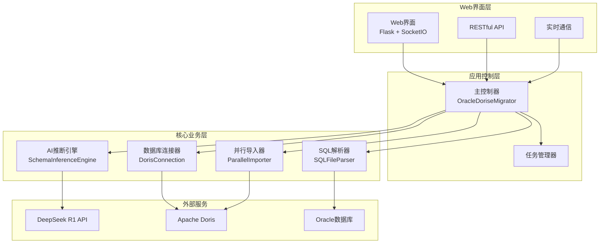
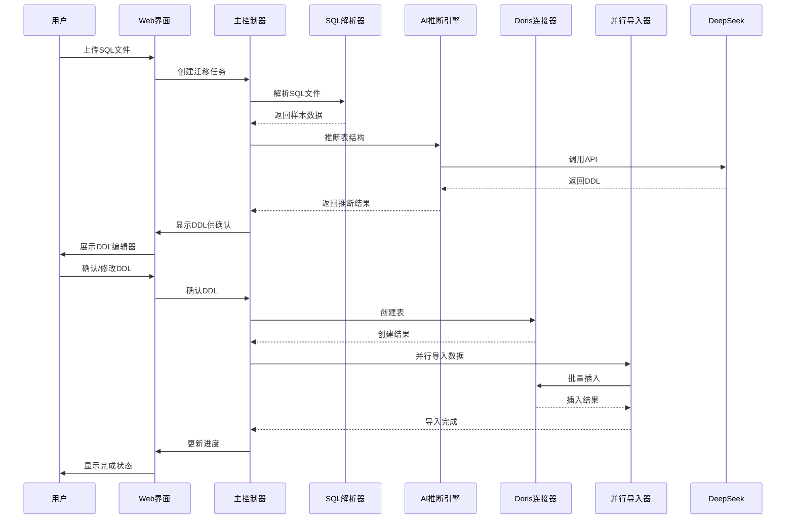
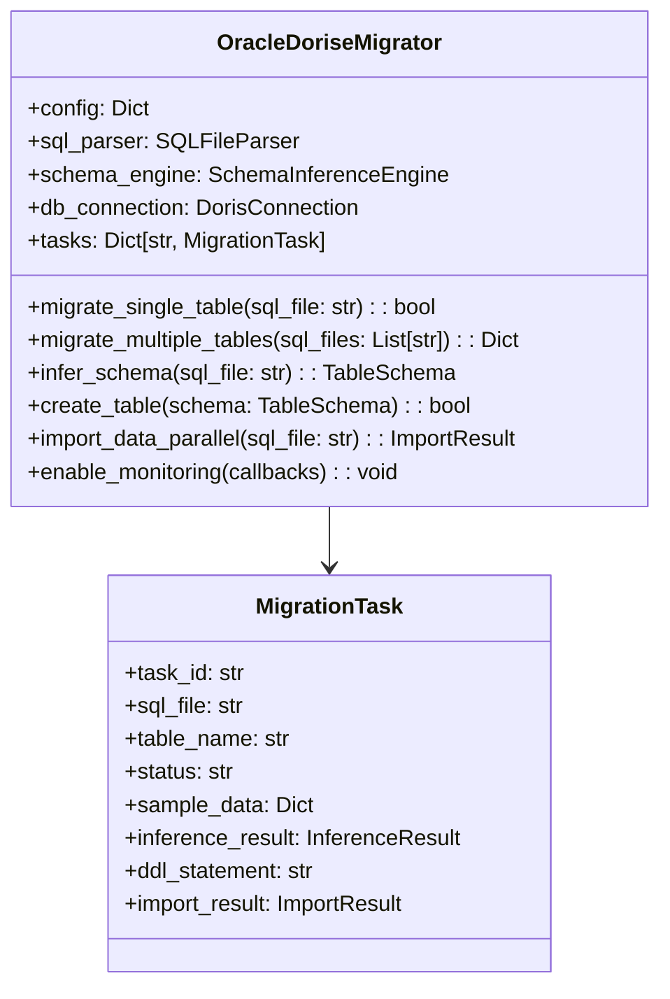
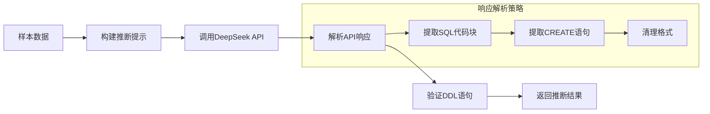
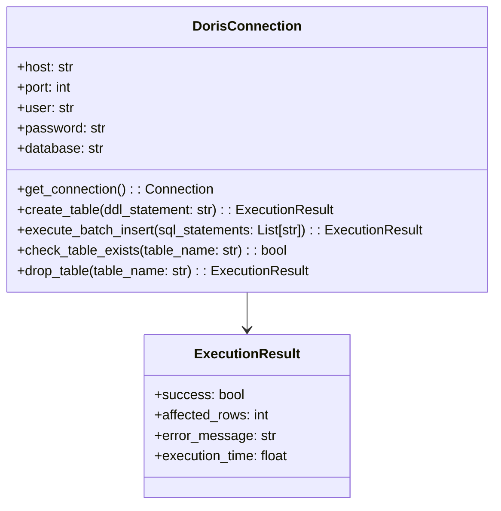
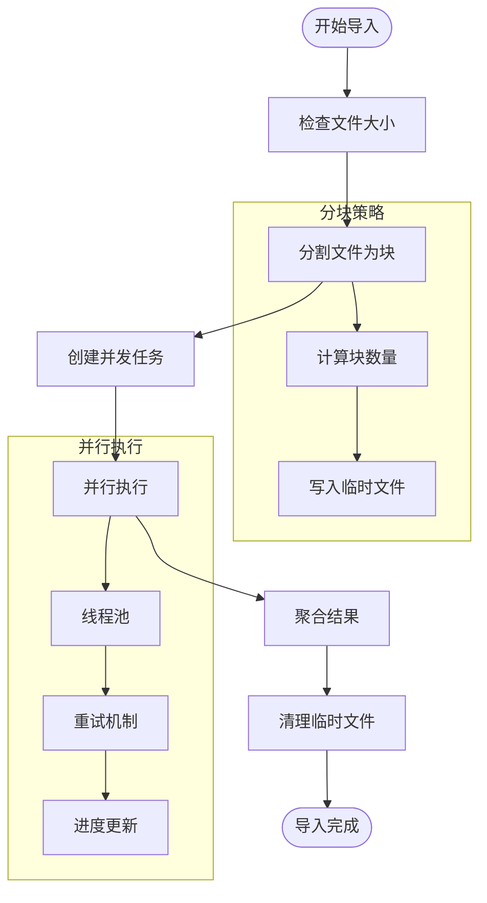
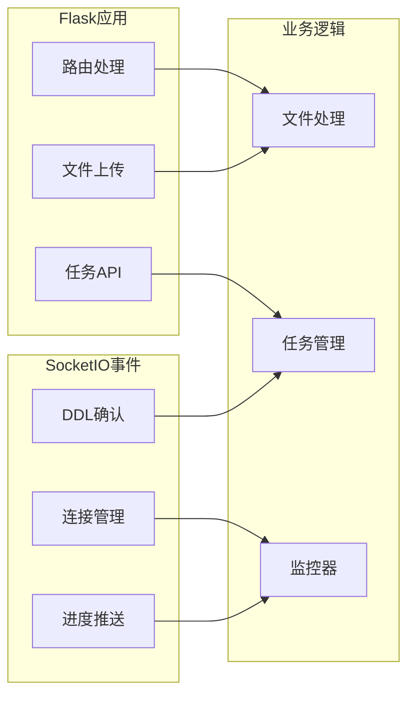

# Oracle到Doris数据迁移工具 - 项目文档

## 1. 项目概述

### 1.1 项目简介
Oracle到Doris数据迁移工具是一个功能完整的数据迁移系统，支持从Oracle数据库到Apache Doris数据库的高效迁移。项目采用AI智能推断技术，结合Web界面交互和高性能并行导入，为企业数据迁移提供完整解决方案。

### 1.2 核心价值
- **AI智能推断**: 使用DeepSeek R1 API自动分析Oracle SQL样本，生成适配Doris的DDL语句
- **用户友好界面**: 提供现代化Web界面，支持拖拽上传、在线编辑和实时监控
- **高性能导入**: 支持大文件分块并行处理，显著提升数据导入效率
- **灵活配置**: 提供丰富的配置选项，适应不同的迁移需求

### 1.3 技术特性
- 支持大数据量迁移（50GB+）
- 实时WebSocket通信
- 智能重试和错误恢复
- 用户确认机制
- 多种运行模式（Web/CLI/测试）

## 2. 系统架构

### 2.1 整体架构



### 2.2 数据流架构



## 3. 核心组件设计

### 3.1 主控制器 (main_controller.py)

主控制器采用门面模式，提供统一的迁移接口。



**核心功能**:
- 任务生命周期管理
- 组件协调和流程控制
- 进度监控和回调处理
- 错误处理和重试机制

### 3.2 SQL解析器 (core/sql_parser.py)

负责解析Oracle导出的SQL文件，提取样本数据。

```mermaid
flowchart TD
    Start([开始解析]) --> ReadFile[逐行读取文件]
    ReadFile --> ExtractSample[提取样本行]
    ExtractSample --> IdentifyTable[识别表名]
    IdentifyTable --> EstimateRows[估算总行数]
    EstimateRows --> ReturnResult[返回解析结果]
    
    subgraph "表名识别策略"
        IdentifyTable --> Pattern1[INSERT INTO table]
        Pattern1 --> Pattern2[INSERT INTO `table`]
        Pattern2 --> Pattern3[INSERT INTO "table"]
        Pattern3 --> Fallback[从文件名推断]
    end
```

**核心功能**:
- 样本数据提取（默认100行）
- 表名智能识别
- 文件大小和行数估算
- SQL格式验证

### 3.3 AI推断引擎 (core/schema_inference.py)

使用DeepSeek R1 API智能推断Doris建表语句。



**核心功能**:
- 智能prompt构建
- API调用和重试机制
- 多模式响应解析
- DDL语句验证

### 3.4 数据库连接器 (core/doris_connection.py)

管理与Apache Doris数据库的连接和操作。



**核心功能**:
- 连接池管理
- DDL/DML语句执行
- 事务管理
- 错误处理和恢复

### 3.5 并行导入器 (core/parallel_importer.py)

实现高性能并行数据导入。



**核心功能**:
- 文件分块处理（默认30MB/块）
- 多线程并行执行
- 进度监控和回调
- 智能重试机制

## 4. Web界面架构

### 4.1 后端架构 (web/app.py)

基于Flask + SocketIO实现的Web后端。



**核心功能**:
- RESTful API接口
- WebSocket实时通信
- 文件上传处理
- 任务状态管理
- 异步任务执行

### 4.2 前端界面 (templates/index.html)

现代化响应式Web界面。

**界面模块**:
- 文件拖拽上传区域
- DDL在线编辑器
- 实时进度监控面板
- 任务列表和详情
- 错误提示和日志显示

## 5. 配置管理

### 5.1 配置结构

```yaml
# 数据库配置
database:
  doris:
    host: "localhost"
    port: 9030
    user: "root"
    password: ""
    database: "migration_db"

# AI推断配置
deepseek:
  api_key: "sk-xxxxx"
  base_url: "https://api.deepseek.com"
  model: "deepseek-reasoner"

# 迁移配置
migration:
  sample_lines: 100
  max_workers: 8
  chunk_size_mb: 30
  batch_size: 1000
  retry_count: 3
  enable_user_confirmation: true

# Web界面配置
web_interface:
  host: "0.0.0.0"
  port: 5000
  debug: false
  secret_key: "your-secret"

# 日志配置
logging:
  level: "INFO"
  file: "migration.log"
```

### 5.2 性能调优参数

| 参数 | 默认值 | 说明 | 调优建议 |
|------|--------|------|----------|
| max_workers | 8 | 并发线程数 | CPU核心数 × 2 |
| chunk_size_mb | 30 | 文件块大小 | 根据内存大小调整 |
| batch_size | 1000 | 批处理大小 | 根据网络延迟调整 |
| sample_lines | 100 | 样本行数 | 保持默认值 |

## 6. 部署和运维

### 6.1 启动方式

**Web界面模式（推荐）**:
```bash
python app.py --mode web
# 访问 http://localhost:5000
```

**命令行模式**:
```bash
python app.py --mode cli
```

**快速测试**:
```bash
python app.py --mode test
```

### 6.2 生产环境部署

**使用Gunicorn**:
```bash
gunicorn -w 4 -b 0.0.0.0:5000 start_web:application
```

**使用Docker**:
```dockerfile
FROM python:3.9-slim
WORKDIR /app
COPY requirements.txt .
RUN pip install -r requirements.txt
COPY . .
EXPOSE 5000
CMD ["python", "app.py", "--mode", "web"]
```

### 6.3 监控和日志

- **应用日志**: migration.log
- **Web服务日志**: web_app.log
- **性能监控**: 支持进度回调和状态监控
- **错误处理**: 完善的异常捕获和重试机制

## 7. 测试

### 7.1 测试文件结构

```
tests/
├── sample_data/
│   ├── users.sql          # 用户表示例
│   └── products.sql       # 产品表示例
├── test_migration.py      # 迁移测试
└── test_config.yaml       # 测试配置
```

### 7.2 测试命令

```bash
# 单元测试
python -m pytest tests/ -v

# 集成测试
python tests/test_migration.py --mode single

# 性能测试
python tests/test_migration.py --mode multiple
```

## 8. API参考

### 8.1 主控制器API

```python
# 初始化迁移器
migrator = OracleDoriseMigrator("config.yaml")

# 迁移单表
success = migrator.migrate_single_table("table.sql")

# 批量迁移
results = migrator.migrate_multiple_tables(["t1.sql", "t2.sql"])

# 仅推断表结构
schema = migrator.infer_schema("table.sql")

# 启用监控
migrator.enable_monitoring(
    progress_callback=lambda msg: print(f"进度: {msg}"),
    error_callback=lambda err: print(f"错误: {err}"),
    completion_callback=lambda result: print(f"完成: {result}")
)
```

### 8.2 Web API接口

| 接口 | 方法 | 说明 |
|------|------|------|
| `/` | GET | 主页面 |
| `/upload` | POST | 文件上传 |
| `/tasks` | GET | 任务列表 |
| `/task/<id>` | GET | 任务详情 |

### 8.3 SocketIO事件

| 事件 | 方向 | 说明 |
|------|------|------|
| `connect` | 双向 | 连接建立 |
| `confirm_ddl` | 客户端→服务端 | 确认DDL |
| `progress_update` | 服务端→客户端 | 进度更新 |
| `task_completed` | 服务端→客户端 | 任务完成 |

## 9. 故障排除

### 9.1 常见问题

**连接Doris失败**:
- 检查Doris服务状态
- 验证网络连通性
- 确认用户权限

**DeepSeek API调用失败**:
- 验证API密钥
- 检查网络连接
- 确认API额度

**内存不足**:
- 减少chunk_size_mb
- 降低max_workers
- 增加系统内存

**文件编码问题**:
- 确保UTF-8编码
- 检查文件完整性

### 9.2 日志分析

启用DEBUG级别日志获取详细信息:
```yaml
logging:
  level: "DEBUG"
```

常见日志模式:
- `INFO - SQL文件解析完成`: 正常解析
- `ERROR - 推断表结构失败`: AI推断问题
- `ERROR - 创建表失败`: 数据库连接问题

## 10. 项目特色

### 10.1 技术创新
- **AI驱动**: 首个集成大语言模型的数据迁移工具
- **实时交互**: WebSocket实现的实时进度监控
- **智能分块**: 自适应文件分块和并行处理
- **用户友好**: 可视化DDL编辑和确认流程

### 10.2 性能优势
- 支持50GB+大文件迁移
- 并行处理提升3-5倍效率
- 智能重试机制保证成功率
- 内存优化支持资源受限环境

### 10.3 易用性特点
- 零配置快速启动
- 拖拽式文件上传
- 在线DDL编辑器
- 详细的错误提示和帮助文档

这个项目成功地将传统的数据迁移工作转变为智能化、自动化的现代化解决方案，为企业数字化转型提供了强有力的技术支持。