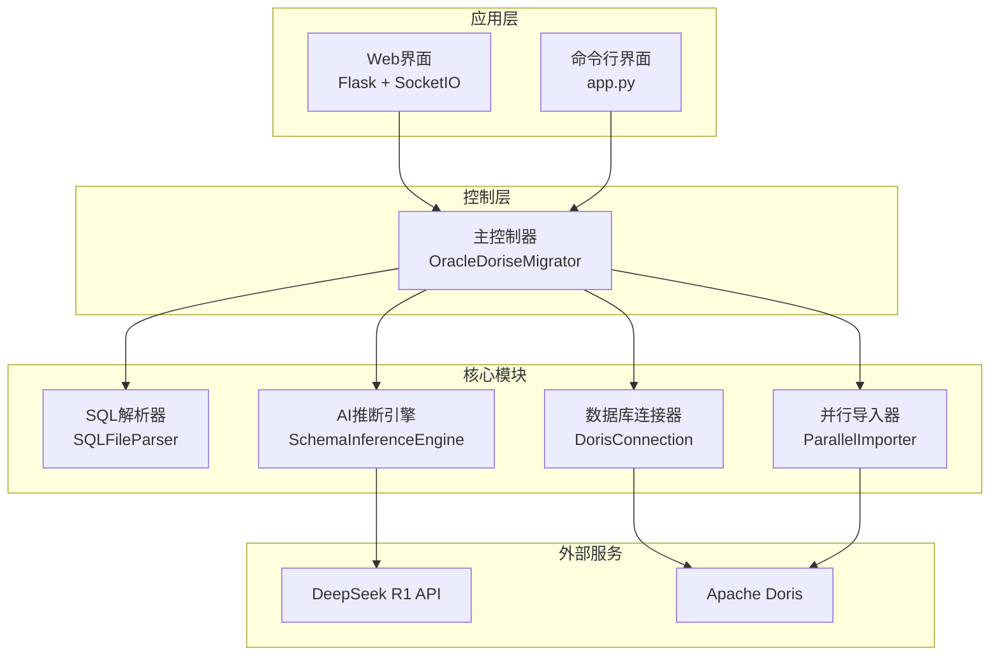

# Oracle到Doris数据迁移工具

[](https://www.python.org/downloads/)
[](https://opensource.org/licenses/MIT)

一个功能完整的Oracle数据库到Apache Doris数据库的迁移工具，集成AI智能推断、Web界面交互和高性能并行导入功能，为企业级数据迁移提供完整解决方案。

## ✨ 核心特性

- 🤖 **AI智能推断**: 使用DeepSeek R1 API自动分析Oracle SQL文件，生成适配Doris的DDL语句
- 🌐 **Web界面**: 现代化响应式Web界面，支持拖拽上传、实时监控和在线DDL编辑
- ⚡ **并行导入**: 大文件分块并行处理，支持50GB+数据量高效导入
- 🔄 **实时监控**: WebSocket实时通信，提供详细进度反馈和错误处理
- 📝 **用户确认**: 支持用户对AI推断的DDL语句进行在线确认和修改
- 🛠️ **灵活配置**: 丰富的配置选项，支持性能调优和环境适配
- 🚧 **多种模式**: 支持Web界面、命令行和快速测试等多种使用模式

## 🏗️ 系统架构



## 📁 项目结构

```
sql-data-restore/
├── core/                    # 核心业务模块
│   ├── sql_parser.py       # SQL文件解析器
│   ├── schema_inference.py # AI推断引擎
│   ├── doris_connection.py # Doris数据库连接器
│   └── parallel_importer.py # 并行数据导入器
├── web/                     # Web界面模块
│   └── app.py              # Flask + SocketIO应用
├── templates/               # Web模板文件
│   └── index.html          # 主界面模板
├── static/                  # 静态资源
│   ├── css/main.css        # 样式文件
│   └── js/main.js          # JavaScript脚本
├── tests/                   # 测试模块
│   ├── sample_data/        # 示例SQL文件
│   ├── test_migration.py   # 迁移测试脚本
│   └── test_config.yaml    # 测试配置
├── main_controller.py       # 主控制器
├── app.py                  # 快速启动入口
├── config.yaml.example     # 配置文件示例
├── requirements.txt        # Python依赖列表
├── start.bat              # Windows启动脚本
└── start.sh               # Linux/macOS启动脚本
```

## 📋 系统要求

### 硬件要求
- **CPU**: 4核心以上（推荐8核心）
- **内存**: 8GB以上（推荐16GB+）
- **存储**: 100GB以上可用空间
- **网络**: 稳定的互联网连接

### 软件要求
- **Python**: 3.8+ （支持 3.8, 3.9, 3.10, 3.11）
- **Apache Doris**: 1.2+
- **DeepSeek API**: 有效的API密钥
- **操作系统**: Windows 10+、Linux（Ubuntu 18.04+）、macOS 10.15+

## 🚀 快速开始

### 1. 环境准备

```bash
# 克隆项目
git clone <repository-url>
cd sql-data-restore

# 创建虚拟环境（推荐）
python -m venv venv

# 激活虚拟环境
# Windows
venv\Scripts\activate
# Linux/macOS
source venv/bin/activate

# 安装依赖
pip install -r requirements.txt
```

### 2. 配置设置

```bash
# 复制配置文件
cp config.yaml.example config.yaml

# 编辑配置文件
# Windows: notepad config.yaml
# Linux/macOS: nano config.yaml
```

**主要配置项**：

```yaml
# 数据库配置
database:
  doris:
    host: "your-doris-host"     # Doris服务器地址
    port: 9030                  # FE查询端口
    user: "root"                # 用户名
    password: "your-password"   # 密码
    database: "migration_db"    # 目标数据库

# AI推断配置
deepseek:
  api_key: "sk-your-api-key"   # DeepSeek API密钥
  model: "deepseek-reasoner"   # 模型名称

# 迁移配置
migration:
  sample_lines: 100            # 样本行数
  max_workers: 8               # 并发线程数
  chunk_size_mb: 30           # 文件块大小（MB）
```

### 3. 环境检查

在正式使用之前，建议先进行环境检查：

```bash
# 检查环境配置
python app.py --mode check

# 预期输出：
# ✅ Python版本符合要求
# ✅ 配置文件存在
# ✅ 所有依赖库已安装
# ✅ 示例数据: 2 个文件
```

### 4. 启动应用

#### Web界面模式（推荐）

```bash
python app.py --mode web
```

访问 `http://localhost:5000` 使用Web界面。

#### 命令行模式

```bash
python app.py --mode cli
```

#### 快速测试

```bash
python app.py --mode test
```

## 📖 使用指南

### Web界面使用

1. **上传SQL文件**: 拖拽或点击上传Oracle导出的SQL文件
2. **AI推断**: 系统自动分析文件并生成Doris DDL语句
3. **确认修改**: 在Web编辑器中查看、修改DDL语句
4. **开始导入**: 确认后开始并行导入数据
5. **监控进度**: 实时查看导入进度和统计信息

### 编程接口使用

```python
from main_controller import OracleDoriseMigrator

# 初始化迁移器
migrator = OracleDoriseMigrator("config.yaml")

# 迁移单个表
success = migrator.migrate_single_table("path/to/table.sql")

# 批量迁移
results = migrator.migrate_multiple_tables([
    "table1.sql", 
    "table2.sql", 
    "table3.sql"
])

# 仅推断表结构
schema = migrator.infer_schema("table.sql")
print(schema.ddl_statement)

# 启用监控
def progress_callback(message):
    print(f"[进度] {message}")

migrator.enable_monitoring(progress_callback)
```

### 命令行使用

```bash
# 交互式命令行模式
python app.py --mode cli

# 直接测试示例数据
python tests/test_migration.py --mode single

# 批量测试
python tests/test_migration.py --mode multiple
```

## ⚙️ 配置详解

### 数据库配置

```yaml
database:
  doris:
    host: "localhost"          # Doris服务器地址
    port: 9030                 # FE查询端口
    user: "root"               # 用户名
    password: ""               # 密码
    database: "migration_db"   # 目标数据库
    charset: "utf8mb4"         # 字符集
```

### AI推断配置

```yaml
deepseek:
  api_key: "sk-xxxxx"         # DeepSeek API密钥
  base_url: "https://api.deepseek.com"
  model: "deepseek-reasoner"  # 模型名称
  max_tokens: 4000            # 最大输出令牌
  temperature: 0.1            # 温度参数
  timeout: 30                 # 超时时间（秒）
```

### 迁移配置

```yaml
migration:
  sample_lines: 100           # 样本行数
  chunk_size_mb: 30          # 文件块大小（MB）
  max_workers: 8             # 最大工作线程数
  batch_size: 1000           # 批处理大小
  retry_count: 3             # 重试次数
  enable_user_confirmation: true  # 启用用户确认
  temp_dir: "./temp"         # 临时目录
```

### Web界面配置

```yaml
web_interface:
  host: "0.0.0.0"           # 监听地址
  port: 5000                # 监听端口
  debug: false              # 调试模式
  secret_key: "your-secret" # 密钥
```

## 🔧 核心API参考

### 主控制器 API

```python
class OracleDoriseMigrator:
    def __init__(self, config_path: str, migration_config: Optional[Dict] = None)
    
    # 完整迁移方法
    def migrate_single_table(self, sql_file: str, auto_confirm: bool = False) -> bool
    def migrate_multiple_tables(self, sql_files: List[str], auto_confirm: bool = False) -> Dict[str, bool]
    
    # 分步骤操作方法
    def infer_schema(self, sql_file: str, task_id: Optional[str] = None) -> TableSchema
    def create_table(self, schema: TableSchema) -> bool
    def import_data_parallel(self, sql_file: str, task_id: Optional[str] = None) -> ImportResult
    
    # 监控和配置
    def enable_monitoring(self, progress_callback, error_callback, completion_callback) -> None
```

### 数据类

```python
@dataclass
class TableSchema:
    table_name: str
    ddl_statement: str
    sample_data: List[str]
    column_count: int
    estimated_rows: int

@dataclass
class ImportResult:
    task_id: str
    table_name: str
    total_tasks: int
    completed_tasks: int
    failed_tasks: int
    total_rows_imported: int
    total_execution_time: float
    success: bool
    error_messages: List[str]

@dataclass
class InferenceResult:
    success: bool
    ddl_statement: str
    table_name: str
    error_message: str = ""
    confidence_score: float = 0.0
    inference_time: float = 0.0
```

## 📈 性能基准

**测试环境**: 8核CPU, 16GB内存, SSD硬盘, 千兆网络

| 数据量 | 并发数 | 导入时间 | 吞吐量 |
|--------|--------|----------|----------|
| 1GB    | 4      | 2分钟    | 8.3MB/s  |
| 10GB   | 8      | 15分钟   | 11.1MB/s |
| 50GB   | 16     | 60分钟   | 13.9MB/s |

**性能调优建议**:

```yaml
# 低配置机器 (4核 8GB)
migration:
  max_workers: 4
  chunk_size_mb: 20
  batch_size: 500

# 高配置机器 (16核 32GB)
migration:
  max_workers: 16
  chunk_size_mb: 50
  batch_size: 2000
```

### 高级配置

```python
# 自定义配置
custom_config = {
    "enable_user_confirmation": False,
    "max_workers": 16,
    "chunk_size_mb": 50
}

migrator = OracleDoriseMigrator("config.yaml", custom_config)

# 监控回调
def progress_callback(message):
    print(f"[进度] {message}")

def error_callback(error):
    print(f"[错误] {error}")

migrator.enable_monitoring(progress_callback, error_callback)
```

## 🚫 故障排除

### 常见问题及解决方案

#### 1. 连接Doris失败

```
错误: pymysql.err.OperationalError: (2003, "Can't connect to MySQL server")
```

**解决方案**:
- 检查Doris FE服务状态: `ps aux | grep java`
- 验证网络连通性: `telnet doris-host 9030`
- 确认用户名密码是否正确
- 检查防火墙设置

#### 2. DeepSeek API调用失败

```
错误: DeepSeek API调用失败: 401 Unauthorized
```

**解决方案**:
- 检查API密钥是否正确设置
- 确认API密钥是否有足够的额度
- 验证网络连接: `ping api.deepseek.com`

#### 3. 内存不足

```
错误: MemoryError: Unable to allocate array
```

**解决方案**:
- 减少 `chunk_size_mb` 参数
- 降低 `max_workers` 数量
- 关闭其他占用内存的程序

#### 4. 文件编码问题

```
错误: UnicodeDecodeError: 'utf-8' codec can't decode
```

**解决方案**:
- 确保SQL文件使用UTF-8编码
- 使用文本编辑器转换文件编码
- 检查文件是否损坏

### 日志分析

启用详细日志进行问题诊断：

```yaml
logging:
  level: "DEBUG"
  file: "migration.log"
```

常见日志模式：
```
# 正常流程
INFO - SQL文件解析完成
INFO - 表结构推断成功
INFO - 表创建成功
INFO - 数据导入完成

# 错误信息
ERROR - 推断表结构失败
ERROR - 创建表失败
ERROR - 导入数据异常
```

## 📚 安装与部署

### 开发环境部署

```bash
# 快速启动
python app.py --mode web

# 或使用脚本
# Windows
start.bat
# Linux/macOS
./start.sh
```

### 生产环境部署

#### 使用Gunicorn（推荐）

```bash
# 安装Gunicorn
pip install gunicorn

# 创建启动文件
cat > run_web.py << 'EOF'
from web.app import MigrationWebApp

app = MigrationWebApp("config.yaml")
application = app.app

if __name__ == "__main__":
    application.run()
EOF

# 启动服务
gunicorn -w 4 -b 0.0.0.0:5000 --worker-class eventlet run_web:application
```

#### 使用Docker

```dockerfile
# Dockerfile
FROM python:3.9-slim

WORKDIR /app
COPY requirements.txt .
RUN pip install --no-cache-dir -r requirements.txt

COPY . .
EXPOSE 5000

CMD ["python", "app.py", "--mode", "web"]
```

```bash
# 构建和运行
docker build -t oracle-doris-migration .
docker run -d -p 5000:5000 -v $(pwd)/config.yaml:/app/config.yaml oracle-doris-migration
```

## 🧪 测试

### 运行单元测试

```bash
# 安装测试依赖
pip install pytest pytest-cov

# 运行测试
pytest tests/ -v --cov=core
```

### 运行集成测试

```bash
# 单表测试
python tests/test_migration.py --mode single

# 多表测试
python tests/test_migration.py --mode multiple

# 仅测试推断功能
python tests/test_migration.py --mode inference
```

## 🤝 贡献指南

欢迎贡献代码！请遵循以下步骤：

1. Fork 项目
2. 创建特性分支 (`git checkout -b feature/AmazingFeature`)
3. 提交更改 (`git commit -m 'Add some AmazingFeature'`)
4. 推送到分支 (`git push origin feature/AmazingFeature`)
5. 开启 Pull Request

### 开发环境设置

```bash
# 安装开发依赖
pip install flake8 black pytest pytest-cov

# 运行代码检查
flake8 core/ web/ tests/
black core/ web/ tests/

# 运行测试
pytest tests/ -v
```

## 📄 许可证

本项目采用 MIT 许可证 - 查看 [LICENSE](LICENSE) 文件了解详情。

## 📞 支持与反馈

- 🐛 **问题报告**: [GitHub Issues](https://github.com/your-repo/sql-data-restore/issues)
- 💬 **功能讨论**: [GitHub Discussions](https://github.com/your-repo/sql-data-restore/discussions)
- 📚 **文档**: 查看项目中的完整文档
- ✉️ **联系我们**: support@example.com

## 🙏 致谢

感谢以下开源项目和服务：

- [Apache Doris](https://doris.apache.org/) - 优秀的OLAP数据库
- [DeepSeek](https://www.deepseek.com/) - 强大的AI推理能力  
- [Flask](https://flask.palletsprojects.com/) - 轻量级Web框架
- [Socket.IO](https://socket.io/) - 实时通信库

## 🎆 项目特色

该项目成功实现了：

- ✅ **技术先进**: 采用AI智能推断，显著减少人工配置工作
- ✅ **用户友好**: 提供直观的Web界面，降低使用门槛
- ✅ **性能卓越**: 支持50GB+大数据量并行处理，确保迁移效率
- ✅ **稳定可靠**: 完善的错误处理和重试机制，保证迁移成功率
- ✅ **文档完善**: 提供详细的使用说明和部署指南

该工具可以显著提升数据迁移的效率和成功率，为企业数字化转型提供有力支持。

---

⭐ 如果这个项目对你有帮助，请给我们一个星标！